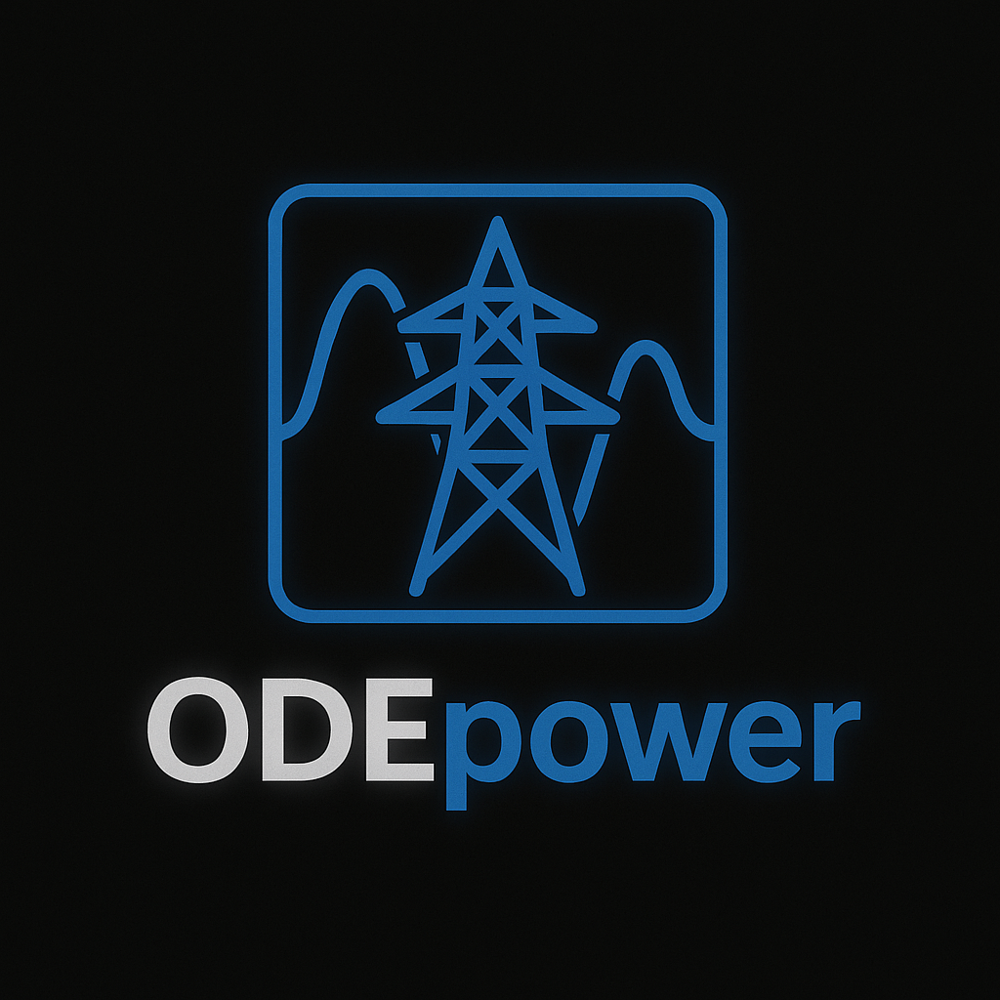

# ODEpower

ODEpower is a Python package for modeling, simulating, and analyzing ODE-based power system grid. It provides a unified interface for graph construction, mathematical tools, simulation, plotting, and MATLAB backend integration.

## Features

- Integrated DC ODE models
- Integrated AC ODE models
- Modular component-based modeling for power electronics and control
- Stability, interaction and modal analysis
- Time-domain simulation of systems
- Tools for reading and processing MATLAB Simulink Simulation
- Extensive test suite for model validation

## Installation

```bash
pip install ODEpower
```
or, for development:
```bash
git clone https://github.com/rannuth/ODEsim.git
cd ODEpower
pip install -e .
```

## Documentation

Full documentation is available at [https://odepower.readthedocs.io](https://odepower.readthedocs.io)

To build the docs locally (with the requirements of ODEpower/requirements.txt):
```bash
cd ODEpower
mkdocs serve
```

## Contributing

Contributions are welcome! Please open issues or pull requests on GitHub.

## License

This project is licensed under GNU General Public License v3 (GPLv3). See `LICENSE.txt` for details.
